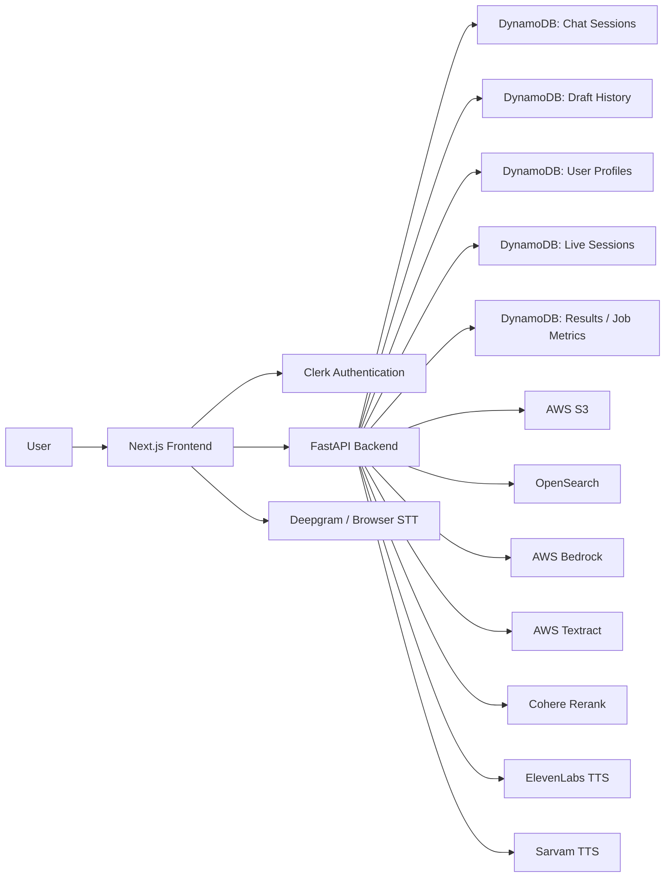
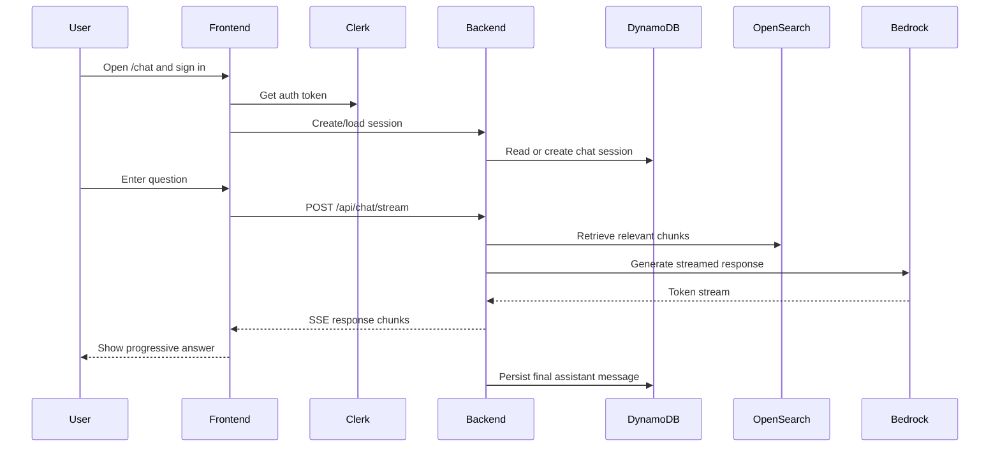
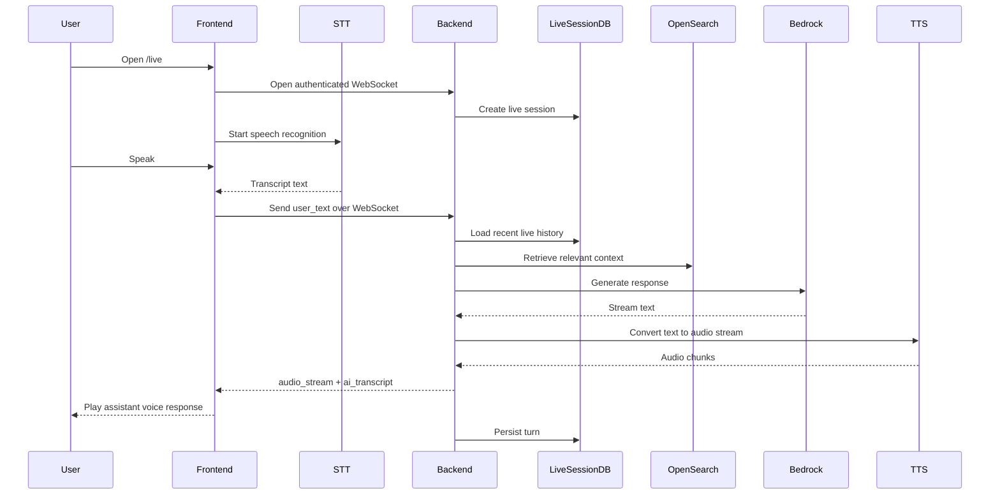
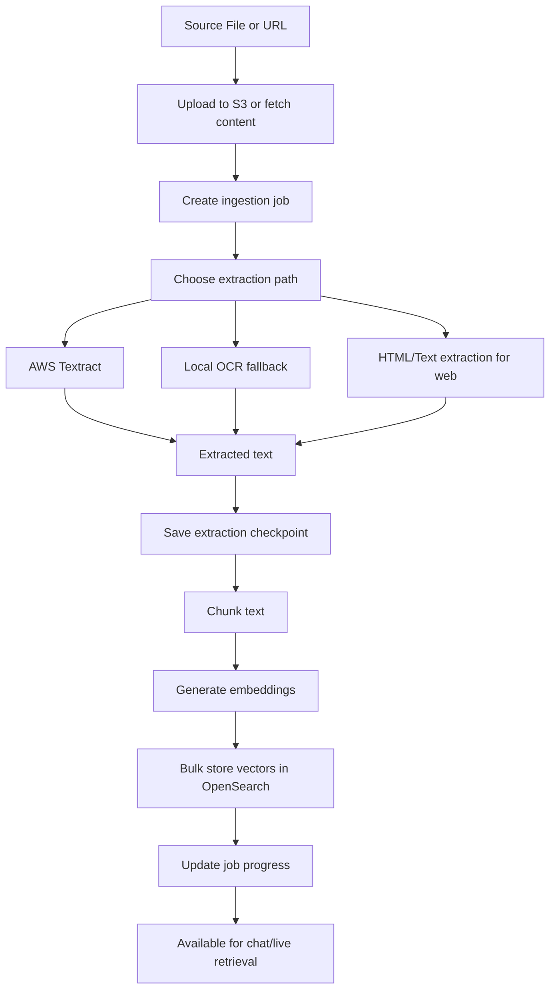
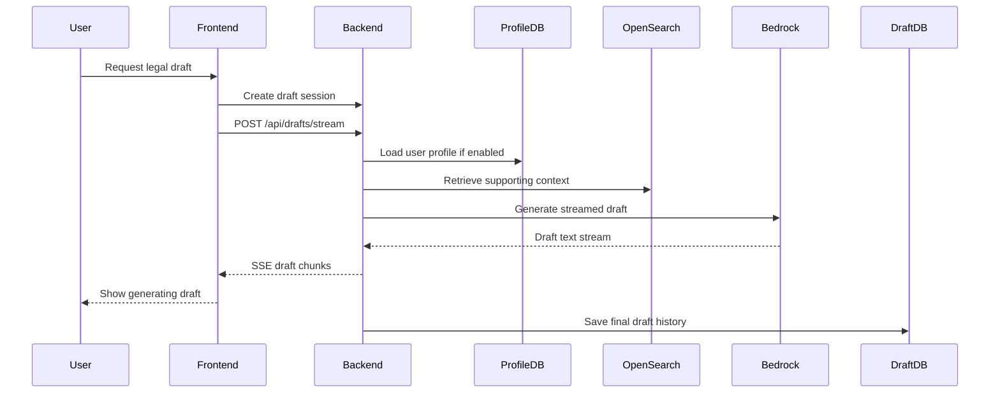

# CivicPulse Notion Documentation With Diagrams

## Suggested Notion Title

`CivicPulse: Full Architecture, User Journeys, Backend Design, And Developer Onboarding`

## Suggested Notion Properties

| Property | Value |
|----------|-------|
| Title | CivicPulse: Full Architecture, User Journeys, Backend Design, And Developer Onboarding |
| Type | Technical Documentation |
| Category | Architecture |
| Tags | civicpulse, architecture, onboarding, rag, live-mode, drafting, ingestion |
| Status | Draft |
| Audience | New Developers, Product Engineers, Backend Engineers, Technical Leads |
| Last Reviewed | 2026-04-08 |

## Notion-Ready Body

```markdown
# CivicPulse: Full Architecture, User Journeys, Backend Design, And Developer Onboarding

## Overview

CivicPulse is an AI-powered legal assistance platform that helps users understand documents, ask legal questions, interact with a live voice assistant, and generate formal legal drafts.

The platform is built as a monorepo with:

- a Next.js frontend in `frontend/`
- a FastAPI backend in `civicpulse-backend/`
- shared documentation and scripts in `docs/` and `scripts/`

At a product level, CivicPulse combines:

- chat-based legal assistance
- live multimodal voice interaction
- legal draft generation
- document and web ingestion
- vector retrieval over a legal knowledge base
- admin-facing operational controls

---

## 1. System Architecture

### High-level architecture



### Core idea

The frontend handles user experience, auth-aware routing, streaming UX, and live interactions.  
The backend handles retrieval, generation, storage, ingestion, OCR, and voice-response orchestration.

The core intelligence loop is:

1. user asks a question or uploads a file
2. backend retrieves relevant context
3. backend builds a mode-specific prompt
4. Claude on Bedrock generates an answer
5. answer is streamed as text or converted to audio

---

## 2. Main Product Surfaces

### Landing page

The landing page positions CivicPulse around:

- Live Mode
- Chat Analysis
- legal risk detection
- multilingual support
- privacy and trust

Primary file:

- `frontend/src/app/page.tsx`

### Chat Mode

Chat Mode supports:

- authenticated chat sessions
- document upload
- background ingestion
- streaming assistant responses
- session history
- shared conversation links

Primary files:

- `frontend/src/app/chat/page.tsx`
- `frontend/src/hooks/useChat.ts`
- `civicpulse-backend/app/routes/chat.py`

### Live Mode

Live Mode supports:

- authenticated WebSocket sessions
- voice input
- audio output
- camera capture
- file upload during live conversation
- draft handoff from conversational context

Primary files:

- `frontend/src/app/live/components/LiveMode.tsx`
- `frontend/src/hooks/useLiveWebSocket.ts`
- `frontend/src/hooks/useLiveAudio.ts`
- `frontend/src/hooks/useLiveCamera.ts`
- `civicpulse-backend/app/routes/live.py`

### Draft Creation

Draft creation supports:

- direct draft requests
- context-based draft requests from chat/live mode
- personalized autofill using stored user profile details
- streaming generation
- saved draft history

Primary files:

- `frontend/src/app/draftcreation/page.tsx`
- `frontend/src/app/draftcreation/hooks/useDraftGeneration.ts`
- `civicpulse-backend/app/routes/drafts.py`

### Admin Panel

The admin panel acts as the operational control plane for the knowledge base:

- run ingestion jobs
- inspect OpenSearch vectors
- inspect DynamoDB records
- inspect S3 uploads
- cancel and clean up jobs

Primary files:

- `frontend/src/app/admin/page.tsx`
- `civicpulse-backend/app/routes/admin.py`

---

## 3. Frontend Perspective

## Framework

The frontend is a Next.js App Router app using:

- React
- TypeScript
- Redux Toolkit
- Clerk
- Tailwind-style utility classes and custom UI components

## Routing model

Main routes:

- `/`
- `/chat`
- `/live`
- `/draftcreation`
- `/admin`
- `/architecture`

Protected routes are enforced by Clerk middleware in:

- `frontend/src/proxy.ts`

Backend API routing is rewritten through:

- `frontend/next.config.js`

This means the frontend calls `/api/...`, while Next rewrites those requests to the backend host.

## Frontend state model

The app uses Redux for shared state, but the main product flows rely heavily on route-specific hooks.

Key shared slices:

- `ui`
- `chat`
- `live`
- `documents`
- `auth`

Important onboarding note:

The current runtime auth system is Clerk-based. Some Redux auth-related types and slices appear older or more generic than the active Clerk implementation.

## Key hooks

### `useChat`

Handles:

- session loading
- session creation
- session deletion
- file upload
- streaming chat requests
- message accumulation

### `useLiveWebSocket`

Handles:

- authenticated WebSocket connection
- reconnect logic
- transcript/audio/draft events
- ingestion progress events

### `useLiveAudio`

Handles:

- browser STT fallback
- optional Deepgram streaming STT
- audio playback queue
- auto-submit timers
- language hot-swap

### `useLiveCamera`

Handles:

- camera activation
- passive frame capture
- still image review flow

---

## 4. Backend Perspective

## Runtime entry point

Backend startup begins in:

- `civicpulse-backend/app/main.py`

It:

- loads environment variables
- configures CORS
- mounts routers under `/api`
- mounts Socket.IO separately
- ensures key DynamoDB tables exist

## Router structure

### `chat.py`

Provides:

- session CRUD
- streamed and non-streamed chat
- user-facing upload endpoint
- share links

### `live.py`

Provides:

- WebSocket auth and lifecycle
- greeting flow
- voice-turn processing
- transcript and audio streaming
- live session cleanup

### `drafts.py`

Provides:

- draft session creation
- streaming draft generation
- draft history

### `user.py`

Provides:

- profile fetch
- profile save

### `admin.py`

Provides:

- ingestion orchestration
- job tracking
- vector management
- S3 and DynamoDB management

## Core service layer

### RAG pipeline

The central backend service is:

- `civicpulse-backend/app/services/rag_pipeline.py`

It handles:

- language detection
- draft intent detection
- conversation-context trimming
- embedding generation
- vector retrieval
- optional Cohere reranking
- prompt assembly
- Bedrock generation

This file is the best single place for a new backend developer to understand how the product “thinks.”

### Supporting services

- `vector_service.py`
- `embedding_service.py`
- `chat_service.py`
- `draft_service.py`
- `profile_service.py`
- `live_session_service.py`
- `dynamodb_service.py`
- `s3_service.py`
- `ocr_service.py`
- `ocr_gatekeeper.py`

---

## 5. Data Architecture

### DynamoDB tables

The system is intentionally split across multiple DynamoDB tables:

- `CivicPulseChats`
- `CivicPulseDrafts`
- `CivicPulseUserProfiles`
- `CivicPulseLiveSessions`
- `CivicPulseResults`
- `CivicPulseJobs`

This separation is important because CivicPulse treats:

- persistent user chat history
- transient live voice sessions
- structured draft history
- profile personalization
- admin job tracking

as distinct data domains.

### S3

S3 stores uploaded source files and checkpoint artifacts.

Used for:

- user-uploaded PDFs/images
- admin ingestion uploads
- downloaded PDF URL content
- extraction checkpoints

### OpenSearch

OpenSearch stores embedded text chunks and supports:

- global knowledge retrieval
- private user-upload retrieval
- metadata-filtered retrieval
- vector deletion by source

---

## 6. Chat Flow Diagram



### Chat flow notes

- chat uses Clerk auth plus backend JWT validation
- answers are streamed through SSE
- chat history is persisted in DynamoDB
- document upload can enrich future retrieval results

---

## 7. Live Mode Flow Diagram



### Live flow notes

- live mode is the most stateful product path
- it combines STT, RAG, TTS, and optional camera/file upload
- language may auto-switch during the session
- the backend can emit a `<DRAFT_READY ... />` marker that the frontend turns into a draft CTA

---

## 8. Ingestion Flow Diagram



### Ingestion notes

- ingestion is a platform-critical system, not a side utility
- it includes cancellation support, checkpoints, progress reporting, and OCR fallback logic
- the admin panel is the main operational interface for ingestion

---

## 9. Draft Generation Flow Diagram



### Drafting notes

- draft mode reuses the same core RAG pipeline with a different prompt and token budget
- user profile data is used to personalize the resulting document
- draft history is stored separately from chat history

---

## 10. AI and Retrieval Strategy

The answer-generation strategy is mode-aware.

### Chat mode

- medium retrieval depth
- streamed answers
- persistent session history

### Live mode

- lower latency path
- smaller context windows
- TTS-friendly prompts
- junk/noise suppression

### Draft mode

- larger retrieval depth
- larger token budget
- document-oriented prompts
- optional profile injection

Prompt templates live in:

- `app/prompts/system_prompt.txt`
- `app/prompts/live_prompt.txt`
- `app/prompts/draft_phase.txt`
- `app/prompts/draft_file.txt`

---

## 11. Language Model and Voice Strategy

Current language support is centered around:

- English
- Hindi

Language logic includes:

- explicit user language selection
- backend heuristic detection
- Devanagari detection
- Hinglish detection
- strict prompt overrides to prevent the model from staying in the wrong language

Voice stack:

- STT via browser speech recognition or Deepgram
- TTS via ElevenLabs for English
- TTS via Sarvam for Hindi

---

## 12. What A New Developer Should Read First

### If you want the fastest understanding of the product

1. `frontend/src/app/chat/page.tsx`
2. `frontend/src/hooks/useChat.ts`
3. `civicpulse-backend/app/routes/chat.py`
4. `civicpulse-backend/app/services/rag_pipeline.py`

### If you are working on live mode

1. `frontend/src/app/live/components/LiveMode.tsx`
2. `frontend/src/hooks/useLiveWebSocket.ts`
3. `frontend/src/hooks/useLiveAudio.ts`
4. `civicpulse-backend/app/routes/live.py`
5. `civicpulse-backend/app/services/live_session_service.py`

### If you are working on ingestion or search quality

1. `civicpulse-backend/app/routes/admin.py`
2. `civicpulse-backend/app/ingestion/pdf_ingest.py`
3. `civicpulse-backend/app/ingestion/image_ingest.py`
4. `civicpulse-backend/app/ingestion/web_ingest.py`
5. `civicpulse-backend/app/services/vector_service.py`
6. `civicpulse-backend/app/services/embedding_service.py`

---

## 13. Important Realities and Gotchas

### Current backend folder

The real backend folder is `civicpulse-backend/`, even though some existing docs still refer to `backend/`.

### Auth reality

The runtime auth model is Clerk-based. Some Redux-era auth artifacts still exist, but they are not the main runtime path.

### Legacy-looking folders

There is a root-level `src/` artifact that appears secondary compared with `frontend/src/`.

### Environment sensitivity

Many issues are integration-driven rather than pure code bugs:

- Clerk config
- Bedrock access
- OpenSearch config
- Deepgram key presence
- Textract limits
- OCR fallback dependencies

### Architecture complexity concentration

The highest-complexity areas are:

- `rag_pipeline.py`
- live-mode hooks
- ingestion orchestrators

These files deserve careful review before making “simple” changes.

---

## 14. Final Summary

CivicPulse is a legal-assistance platform built around a shared retrieval and AI backbone that powers:

- streamed legal chat
- live voice assistance
- formal legal drafting
- document and web ingestion
- multilingual English/Hindi interaction
- admin-managed knowledge base operations

Its real strength is not just the UI or just the model integration. It is the way ingestion, retrieval, prompting, voice, and storage have been combined into one cohesive product system.
```

## Publishing Note

This file is ready to paste into Notion. Mermaid blocks can be kept as code blocks, converted into screenshots, or redrawn in Notion if your workspace does not render Mermaid natively.
